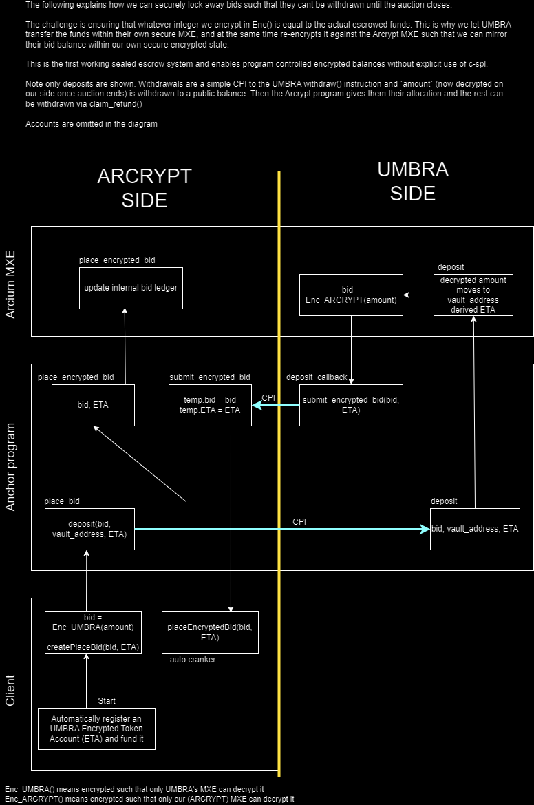

# ARCRYPT

**WAITLIST OPEN NOW. Refer a friend to move up in the list. Join us at [arcrypt.bid](https://arcrypt.bid)**

ARCRYPT is an upcoming sealed-bid auction platform on Solana. It lets sellers auction tokens, NFTs, or metadata-only assets without exposing competing bids on-chain, helping prevent front-running, MEV, and other forms of bid leakage. Bid amounts are processed privately through Arcium MPC, while settlement still happens transparently on Solana. For the first time ever we leverage UMBRA to conceal committed bid escrows on chain, as well as hiding the same bid amount transmitted to Arcium MXE. 

Telegram: https://t.me/+NGbdEEbM-AYyNDZk
Twitter (X): https://x.com/arcrypt_bid

* 05/20 1pm: Legacy escrows temporarily enabled whilst we investigate an issue with refunds.

## What ARCRYPT does

ARCRYPT is built for private price discovery.

Traditional public auctions reveal bids as they arrive, which can distort outcomes and invite manipulation. ARCRYPT instead keeps bids encrypted, computes winners privately, and settles only the final result on-chain.

It supports:

* Sealed-bid auctions on Solana
**Total encryption of escrowed bid balances using UMBRA**
* First-price auctions
* Vickrey (second-price) auctions
* Uniform-price auctions for multi-winner sales (up to 3 winners)
**Launching a token to Raydium once the auction ends for instant swaps**
* Launching an NFT (Possibly pending deprecation)
* DAO treasury auctions through proposal instructions

## How it works

ARCRYPT combines four pieces:

* **Solana program**: stores auction state and handles settlement
* **Cross Program Invocation with UMBRA Solana program**: Locks encrypted bids as escrows in the UMBRA shielded pool
* **Arcium confidential compute**: evaluates encrypted bids without exposing them
* **Client app + SDK**: creates auctions, places bids, securely escrows funds, settles winners and creates the Raydium pool at settlement.

## **Procedure**

1. A seller creates a project which mints a token and creates an auction through Arcrypt.
2. Bidders place encrypted bids from their personal encrypted balance (See below).
3. Funds are escrowed securely within the UMBRA shielded pool (See below).
4. Off-chain worker calls MPC to determine the winner and reveal it publicly, it also transfers tokens to the winner.
5. To claim their rewards, the auction creator clicks "Claim payout and create pool" on the dashboard, releasing the USDC to the Raydium DEX seeded at the clearing price.
6. Losers reclaim their bids manually by clicking "Claim refund". 

Under the hood, when submitting a bid:

1. The client generates an encrypted token account and funds it with USDC using the dashboard.
2. The bid client encrypts their bid against Umbra’s MXE and submits it to Arcrypt.
3. Arcrypt performs a CPI into Umbra, passing the encrypted token account and bid amount.
4. Umbra decrypts the bid inside its own Arcium MXE and allocates the corresponding funds into its shielded pool.
5. Umbra re-encrypts the bid for Arcrypt’s MXE and CPIs back to Arcrypt with the ciphertext via `submit_encrypted_bid`.
6. `submit_encrypted_bid` stores the encrypted bid in a temporary on-chain account seeded by random nonce (to resolve double bids from same user).
7. A crank calls `place_encrypted_bid`, feeding the ciphertext into Arcium MPC to update the encrypted auction state.
8. At all times, funds remain encrypted and program-controlled, ensuring fully confidential escrow with no plaintext balances on-chain.



## Repository structure

* `client/` — the website and user interface
* `sdk/` — the TypeScript library (`@arcrypt/sdk`) for auction commands
* `arcrypt/` — the on-chain program and Arcium computation setup

## Prerequisites

Before running the project, install the tools required by Solana and Arcium.

You will need:

* Git
* Node.js
* npm or pnpm
* Rust and Cargo
* Solana CLI
* Anchor
* Arcium tooling

Follow the Arcium Solana installation guide first:

[https://docs.arcium.com/developers/installation](https://docs.arcium.com/developers/installation)

## Getting started

### 1) Clone the repository

```bash
git clone https://github.com/b-adamson/arcrypt
cd arcrypt
```

### 2) Start a local Arcium Solana environment

Open a new terminal and run:

```bash
cd arcrypt
arcium localnet
```

This builds the program and starts the local environment used by the program and confidential computation runtime.

### 3) Initialize the computation definitions (localnet only)

This step is required when running ARCRYPT on a **local Arcium + Solana environment**. It registers all confidential computation definitions (auction init, bidding, winner selection) with the Arcium runtime.

First, create a `.env` file inside `arcrypt`:

```bash
OWNER_KEYPAIR_PATH=~/.config/solana/id.json
ARCIUM_CLUSTER_OFFSET=0
SOLANA_RPC_URL="http://localhost:8899"
```

- `OWNER_KEYPAIR_PATH` → path to your local Solana wallet  
- `ARCIUM_CLUSTER_OFFSET` → cluster index (use `0` for localnet)  
- `SOLANA_RPC_URL` → local validator RPC endpoint  

Then run:

```bash
cd arcrypt
ts-node initcompdef.ts
```

### 4) Airdrop SOL to your wallet

To fund your local wallet on the local validator, run:

```bash
solana airdrop 1000 <YOUR_WALLET_PUBKEY> --url http://localhost:8899
```

### 5) Run the website

The website is in `client/`.

```bash
cd sdk
npm run build
cd ../client
npm install
npm run dev
```

## SDK

The `sdk/` folder contains the TypeScript library for auction actions.

It exposes the commands used by the app and by integrators, including:

* `createAuction`
* `createPlaceBid`
* `createDetermineWinner`
* `createSettlement`
* low-level tx builders

Install it with:

```bash
npm install @arcrypt/sdk
```

Note: the package may not be published yet, so for development you may need to import it directly from the repository. In the client, this is done automatically (see client/package.json)

## Auction types

ARCRYPT supports multiple auction styles:

* **First-price**: highest bidder wins and pays their bid
* **Vickrey**: highest bidder wins and pays the second-highest bid
* **Uniform-price**: submit a price and an amount. winners ordered by price and they pay their amount (price * amount = FDV)

## Asset types

ARCRYPT supports:

* **Fungible**: token sales (routes through Uniform mode by default)
* **NFT**: single-item sales (routes through FirstPrice mode by default) (Potentially pending deprecation)
* **MetadataOnly**: auctions without token transfer, useful for rights/access or proofs (Potentially pending deprecation)

## Developer workflow overview

The on-chain program is built around a few core steps:

1. **Create auction**
2. **Place bid**

There are many functions for placing bids. `place_bid` is called by the client and uses legacy escrows. `deposit_encrypted_bid` is used by the client and is the entrypoint for the encrypted escrows (pending SDK support). `submit_encrypted_bid` is the cpi callback from umbra that receives the bid amount encrypted against our own MXE and sends to PendingEncryptedBid account. `place_encrypted_bid` is cranked clientside in vercel to move the temp account bid to MPC to avoid async issues. 

3. **Determine winner privately** Called automatically. Click Refresh if you cannot see it. 
4. **Finalize settlement** Called automatically. Click Refresh if you cannot see it. 
5. **Creator usdc claim and raydium pool creation** Called manually. See roadmap.

Currently, withdrawals of winner tokens and refunds go to the user public ATA, as this does not need to be encrypted. 

## Example SDK usage

The arcrypt.bid website uses the arcrypt sdk extensively to make auctions. 

```ts
import { PublicKey } from "@solana/web3.js";
import { createAuction, createPlaceBid } from "@arcrypt/sdk";

async function main() {
  const programClient = /* your Anchor client */;
  const programId = new PublicKey("PROGRAM_ID");
  const wallet = new PublicKey("WALLET_PUBKEY");

  const auction = await createAuction({
    programClient,
    programId,
    publicKey: wallet,
    authorityBase58: wallet.toBase58(),
    minBidSol: "1.0",
    durationSecs: 3600,
    auctionType: "FirstPrice",
    assetKind: "Fungible",
    metadataUri: "https://example.com/meta.json",
    tokenMint: "TOKEN_MINT",
    saleAmountToken: "100",
  });

  const bid = await createPlaceBid({
    programClient,
    programId,
    publicKey: wallet,
    auctionPk: auction.auctionPda,
    bidAmountSol: "2.5",
  });

  console.log("Auction TX:", auction.transaction);
  console.log("Bid TX:", bid.transaction);
}

main().catch(console.error);
```

## Program ID

On devnet we are deployed at
* `BPKLg61gd4FChxuFkn2VEEbT9cMED5nsSYRi84j5FRaK`

## Troubleshooting

* Make sure the Arcium localnet is running before initializing computation definitions.
* Make sure your Solana CLI points to the local validator when testing locally.
* If bid settlement fails, confirm that the auction has ended and the correct settlement instruction is being used.
* Make sure, if testing in localnet, you have ARCIUM_CLUSTER_OFFSET=0 specified as a client environment variable. The SDK will default to 0 (localnet). The devnet program is deployed at 456
* Make sure the pool has enough USDC and/or the creator has enough devnet SOL to make the pool (See roadmap)
* Do not be scared by stack offsets on the arcium build process. They are entirely due to the umbra functions called from codema and not our own Arcrypt code. Use `<Box>` to make acounts more space-efficient if needed. 

## Roadmap

Planned and in-progress areas include:

* Expand token mode. Right now we are focusing on NFTs as its the easiest to do, but once we can get many bids setup we can enable uniform auctions for many winners. We may deprecate token mode if this is not feasible. NFTs are a valuable unlock and we want to deliver it, since this is the only possible way to run a sealed nft auction. 
* On-chain CPI into Raydium so off-chain worker can auto create the Raydium pool, using liquidity from the auction to cover tx fees in token mode. 
* Move instructions out of API. This is currently due to the arcium ts package pulling backend only imports which Next.js complains about.
* Upgrade SDK support for fine grain txs and better callbacks on the encrypted bid placement.
* Make async tx signs appear as just one wallet sign for supported wallets. place_bid will eventually be just one sign. 
* UI Overhaul
* **Mainnet Launch this Summer**

## License

Business Source License 1.1 (BSL)